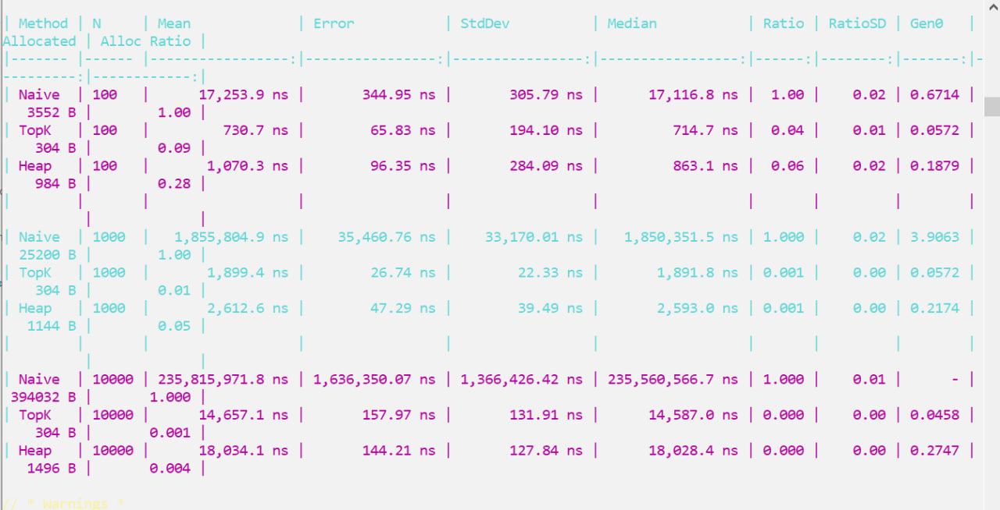

## Сравнение производительности алгоритмов

Производительность алгоритмов подбора ближайших водителей измерена с помощью BenchmarkDotNet.
По результатам бенчмарков наивный алгоритм работает значительно медленнее и выделяет заметно больше памяти, чем оптимизированные варианты TopK и Heap при всех размерах входных данных. Алгоритмы TopK и Heap обрабатывают даже 10 000 водителей за десятки микросекунд, то есть на несколько порядков быстрее наивного перебора, при этом TopK в среднем немного быстрее и экономичнее по памяти, чем Heap.

